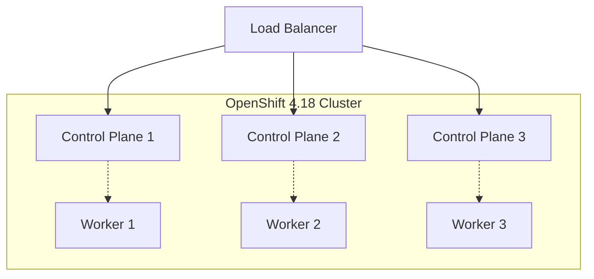

# Workshop Diagrams

This directory contains technical diagrams that are referenced directly in the workshop modules. All diagrams should be accessible via the workshop content and properly rendered.

## Directory Structure

```
diagrams/
├── architecture/        # System architecture diagrams
├── network/            # Network topology and configuration diagrams
├── installation-flows/ # Installation process flow diagrams
└── README.md          # This file
```

## Diagram Categories

### Architecture Diagrams (`architecture/`)
- `openshift-cluster-overview.svg` - Overall cluster architecture
- `node-types-and-roles.svg` - Control plane vs worker node roles
- `storage-architecture.svg` - Storage integration overview
- `security-architecture.svg` - Security components and flow

### Network Diagrams (`network/`)
- `network-topology.svg` - Physical network layout
- `dns-hierarchy.svg` - DNS resolution flow
- `load-balancer-placement.svg` - Load balancer architecture
- `firewall-rules.svg` - Required firewall configurations
- `advanced-networking.svg` - SR-IOV, Multus, and advanced features

### Installation Flow Diagrams (`installation-flows/`)
- `assisted-installer-workflow.svg` - Assisted Installer process
- `agent-based-installer-workflow.svg` - Agent-based Installer process
- `installation-method-decision-tree.svg` - Method selection guide
- `troubleshooting-flowchart.svg` - Common issue resolution

## Diagram Standards

### File Formats
Preferred formats (in order):
1. **SVG** (.svg) - Scalable vector graphics, best for web rendering
2. **PNG** (.png) - High-resolution raster images
3. **Mermaid** (.mmd) - Text-based diagrams (with SVG export)

### Naming Convention
- Use kebab-case names
- Include version when relevant
- Be descriptive and specific
- Examples:
  - `openshift-4.18-cluster-architecture.svg`
  - `assisted-installer-workflow.svg`
  - `network-dns-resolution-flow.svg`

### Content Standards
- Include title and version information in the diagram
- Use consistent colors and styling across diagrams
- Include legends when necessary
- Keep diagrams focused and not overly complex
- Ensure text is readable at different sizes
- Include source attribution and last updated date

## Usage in Workshop Modules

### Basic Image Reference
```adoc
.OpenShift 4.18 Cluster Architecture
image::diagrams/architecture/openshift-cluster-overview.svg[OpenShift Cluster Architecture,800,600]
```

### Image with Caption and Link
```adoc
.Network Topology for OpenShift Deployment
image::diagrams/network/network-topology.svg[Network Topology,600,400]

For detailed network configuration, see the link:https://docs.redhat.com/en/documentation/openshift_container_platform/4.18/html/installing_on_bare_metal/user-provisioned-infrastructure#installation-network-user-infra_installing-bare-metal[OpenShift networking requirements].
```

### Inline Diagram Reference
```adoc
The installation process follows the workflow shown in 
image:diagrams/installation-flows/assisted-installer-workflow.svg[Assisted Installer Workflow,400,300].
```

## Creating Diagrams

### Mermaid Diagrams
For version-controlled, text-based diagrams:



Export to SVG for use in workshop content.

### Draw.io/Diagrams.net
For complex technical diagrams:
1. Create diagram in Draw.io
2. Export as SVG with embedded fonts
3. Optimize for web display
4. Save source .drawio file for future edits

## Diagram Maintenance

### Regular Updates
- Review diagrams when OpenShift versions change
- Update diagrams when workshop content is modified
- Verify all referenced components are current
- Test diagram rendering in workshop environment

### Version Control
- Keep source files (.drawio, .mmd) alongside exported images
- Document changes in commit messages
- Archive outdated diagrams with version labels
- Maintain backward compatibility when possible

### Quality Assurance
- Test diagram rendering at different sizes
- Verify accessibility (alt text, color contrast)
- Ensure diagrams work in both light and dark themes
- Validate technical accuracy against official documentation

## Integration with Research

Diagrams are created based on research findings:

1. **Research Analysis**: Review answers in `research/answers/`
2. **Diagram Planning**: Identify visual concepts that need illustration
3. **Diagram Creation**: Create diagrams based on authoritative sources
4. **Workshop Integration**: Reference diagrams in appropriate modules
5. **Validation**: Ensure diagrams accurately represent official documentation

All diagrams should be traceable back to official Red Hat documentation and research sources.
